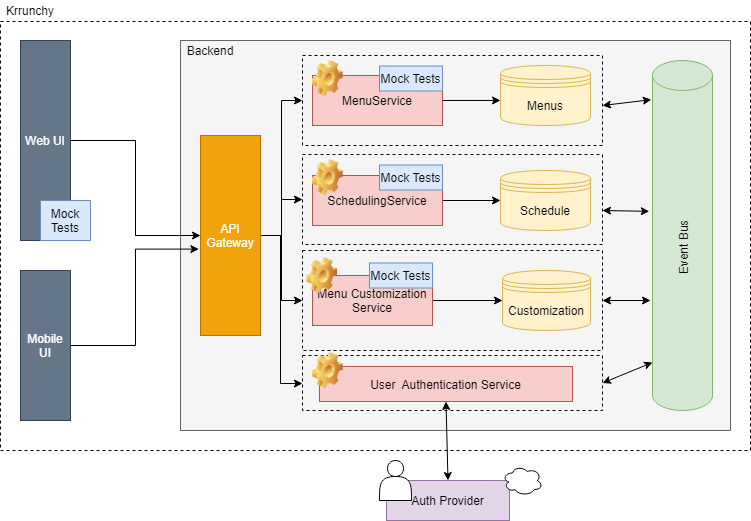

# Krrunchy Architecture

Krrunchy will be a microservices based web application that can be accessed by Web and Mobile UI clients. 

- Each microservice will be a well defined feature with its own database. I intend to use SQL DBs for now.
- These microservices will communicate in a choreographed SAGA pattern via an event bus. 
- The authentication will be based on OAuth2 framework using Google as the authentication provider
- The microservices will be accessible via an API gateway.
- Each microservice will have its own unit tests
- There will be 2 types of clients - Web based UI and an Android based UI. These clients will have their own unit tests.

## Technology Choices
1. PostgreSQL for al the DBs
2. Springboot for the microservices. JUnit and Mockito for the unit tests.
3. Docker for containerization
4. Apache Kafka for event bus
5. Angular for the web client
6. REST-Assured for API testing
7. Android for Mobile Client
8. API Gateway (yet to be finalized)

## Tools
1. Eclipse IDE for Springboot development.
2. Postman for API testing

## Microservices

### Menu Service - [Repository](https://github.com/zsurka/krrunchy-menu-service)

 This service will be responsible to 
 1. Add new menu as defined by Kitchen Admin (admin access only)
 2. Modify existing menus  (admin access only)
 3. Delete existing menus by ID  (admin access only)
 4. Retrieve existing menus by ID
**Dependencies** - None

### Scheduling Service - [Repository](https://github.com/zsurka/krrunchy-scheduling-service)

  This service will be responsible to 
  1. Schedule a given menu ID on a given date (admin access only)
  2. Schedule a blackout date (admin access only)
  2. Get a weekly menu from given start date
  3. Get the menu of a given date
**Dependencies** - Menu Service

### Customization Service 
To be analysed.

 This service will be responsible to 
  1. Customize a menu on a given date for a given user
  2. Retrieve customizations for given user (admin access only)
  3. Retrieve all customizations for a given date. (admin access only)
  **Dependencies** - Menu Service, Scheduling Service

  ### User Authentication Service
  To be analysed.
  This service will be responsible to generate and validate OAuth2 tokens for user interaction.

  ## Clients

  ### Web UI Client - [Repository](https://github.com/zsurka/krrunchy-client-angular)
  
  This is an Angular based application to interact with the Krrunchy Backend.
  - Tools - Visual Studio Code
  - Nodejs and Angular
  - Unit tests to be written using Jasmine or Karma. 

  ### Mobile Client (Android) [Repository] (https://github.com/zsurka/krrunchy-client-android)

  This is a mobile client created using Android / Java using Android Studio. 

