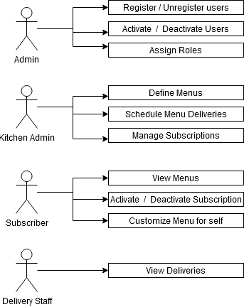

# Krrunchy Functional Specification

## Objective
To help my community kitchen resolve their current pain areas and provide them a sustainable and customizable solution. To understand the details of running a community kitchen and design a solution for them.

## User Personas

**Kitchen Administrator** - who defines menus and blackout dates and manages the day to day operations.
Admins will be able to 
1. Publish menus
2. Publish blackout dates
3. See customizations on a per subscriber basis 
4. Read feedback
5. Get statistics of the subscriber base

**Subscriber** - who is the recipient of the food.
The subscribers will able to 
1. Check daily and weekly menus
2. Check blackout dates (when food will not be delivered)
3. Request customization or cancellation
4. Share feedback

**Delivery Person** - who is responsible to pack the food and deliver it to the subscriber.
The subscribers will able to
1. See deliveries of the day

**System Administrator** - super user of the application who will analyse trends and drive the IT side of this community kitchen.
1. Will deploy the application and configure updates.
2. Grant and revoke its access. 
3. Register users and deregisters when needed.
4. Responsible for security and availability.
5. Resolve technical issues of subscribers and kitchen staff

## Terms
1. Menu - fixed set of food items to be delivered
2. Blackout Date - food will not be delivered on this day. Defined by Kitchen Administrator.

## Use Cases (by priority)
**Use Case 1** Subscriber needs to know today’s menu.

The only way today is that admin needs to post menu of the day on the whatsapp group. This requires repeated typing, and is additional work for management. After lot of such messages on the group, the menu of the day needs to scrolled and searched for.
  
**Use Case 2** Subscriber needs to inform kitchen admin that s/he is wants to cancel the food delivery for that particular day.

The only way for the subscriber to do that is by posting a message on whatsapp group. In a group of such large numbers, it is possible that the admin may miss this message. This causes food wastage and frustration for kitchen management.

**Use Case 3** Subscriber wants to request modification of menu or cancel a modification already requested.

This is the most painful scenario for the kitchen staff. The subscribers post such customizations on the whatsapp group and the admin actually needs to keep track of such ad hoc requests. E.g. one subscriber needs more rice, another needs no chapattis at all. This is highly error prone and cumbersome since whatsapp is not designed for such work at all.

